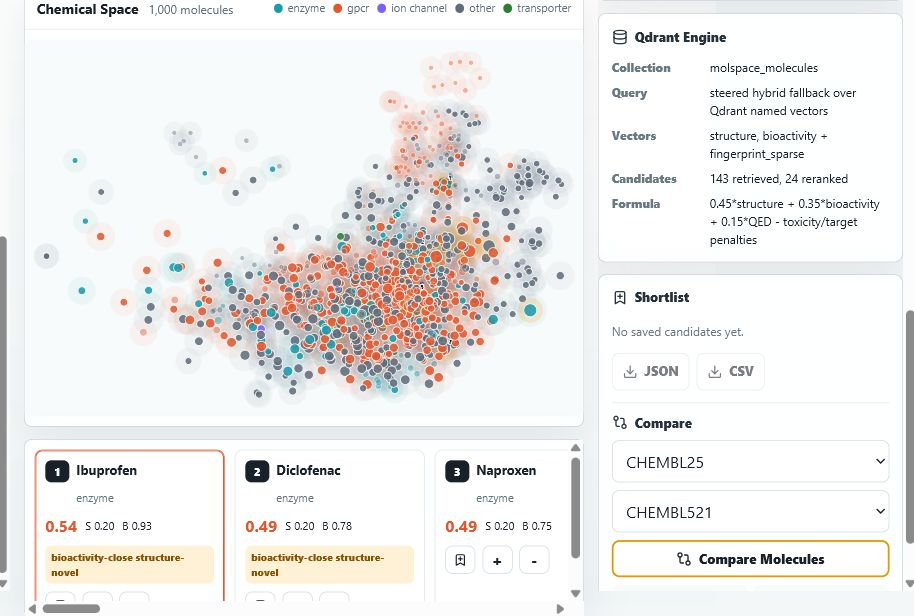
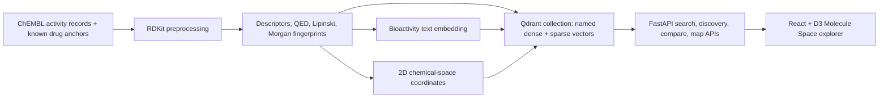

# Molecule Space

**Molecule Space** is a Qdrant-powered molecular discovery navigator built for the Qdrant **Think Outside the Bot** hackathon. It is deliberately not a chatbot. It is an interactive visual search product that helps researchers explore chemical neighborhoods across **structure**, **bioactivity**, and **drug-likeness** signals.



## What It Does

Drug discovery often starts with a known molecule and a deceptively hard question:

> What else is chemically similar, biologically relevant, drug-like, and not obviously risky?

Molecule Space turns that question into an interactive map:

- Search by known molecule name or SMILES, such as `aspirin` or `CC(=O)Oc1ccccc1C(=O)O`
- Explore a 2D chemical-space map with target-class overlays
- Switch between structure, bioactivity, hybrid, and target-shift retrieval
- Filter candidates by molecular weight, LogP, QED, Lipinski violations, target class, and toxicity heuristic
- Steer discovery toward positive examples and away from negative examples
- Compare two molecules across structure, bioactivity, descriptors, targets, and map distance
- Shortlist promising candidates and export JSON/CSV
- Inspect exactly how Qdrant was used for every search

Molecule Space is an exploratory screening demo, not a clinical prediction system. Drug-likeness, toxicity, and outlier labels are heuristic signals for navigation.

## Why Qdrant Is Core

Qdrant is the retrieval engine at the center of the app. Each molecule is stored as one Qdrant point in the `molspace_molecules` collection with multiple vector representations and rich payload metadata.

| Qdrant Feature | How Molecule Space Uses It |
| --- | --- |
| Named dense vectors | `structure` and `bioactivity` vectors live on the same molecule point |
| Sparse vectors | `fingerprint_sparse` stores active Morgan fingerprint bit ids |
| Payload filtering | Restricts candidates by MW, LogP, QED, Lipinski violations, target class, and toxicity flag |
| Hybrid retrieval | Fuses structure, bioactivity, and sparse fingerprint results with Qdrant prefetch/RRF |
| Discovery steering | Uses positive/negative examples to steer toward or away from molecule neighborhoods |
| Payload indexes | Adds indexes for common filter fields when using Qdrant Cloud/server mode |
| Transparency panel | Shows collection, vectors, filters, candidates retrieved, reranked count, and scoring formula in the UI |

Point shape:

```json
{
  "id": 1,
  "vector": {
    "structure": [0.0, 0.1, "..."],
    "bioactivity": [0.03, 0.0, "..."],
    "fingerprint_sparse": {
      "indices": [12, 88, 901],
      "values": [1.0, 1.0, 1.0]
    }
  },
  "payload": {
    "molecule_id": "CHEMBL25",
    "name": "Aspirin",
    "canonical_smiles": "CC(=O)Oc1ccccc1C(=O)O",
    "target_class": "enzyme",
    "qed": 0.55,
    "molecular_weight": 180.16,
    "logp": 1.19,
    "lipinski_violations": 0,
    "toxicity_flag": "low",
    "umap_x": 12.4,
    "umap_y": -3.8
  }
}
```

## Architecture



## Feature Highlights

### Structure Search

Uses RDKit Morgan fingerprints and Qdrant's `structure` named vector. Candidates are reranked with RDKit Tanimoto similarity for chemistry-aware scoring.

### Bioactivity Search

Builds a target/activity text profile for each molecule and embeds it into the `bioactivity` named vector. This finds molecules that may behave similarly even when they look structurally different.

### Hybrid Search

Uses Qdrant prefetch/RRF over:

- `structure`
- `bioactivity`
- `fingerprint_sparse`

Then reranks candidates with:

```text
0.45 * structure_similarity
+ 0.35 * bioactivity_similarity
+ 0.15 * QED
- toxicity / target-shift penalties
```

### Discovery Steering

Users can mark molecules as **Toward** or **Away**, then run Discovery Mode. The backend attempts Qdrant discovery/context search and falls back to a steered hybrid vector when needed, preserving the positive/negative exploration behavior.

### Explainability

Every selected molecule includes a "Why this matched" panel with structure similarity, bioactivity similarity, QED/Lipinski status, target neighborhood, map region, toxicity heuristic, and novelty/outlier badge.

## Tech Stack

| Layer | Technology |
| --- | --- |
| Vector database | Qdrant Cloud or local Qdrant client mode |
| Backend | FastAPI, Python, Qdrant Client |
| Chemistry | RDKit |
| ML/vectorization | scikit-learn hashing embeddings, Morgan fingerprints |
| Frontend | React, TypeScript, Vite |
| Visualization | D3 |
| Styling | Tailwind CSS + custom CSS |

## Project Structure

```text
.
|-- backend/
|   |-- app/
|   |   |-- chemistry.py       # RDKit descriptors, fingerprints, SVG structures
|   |   |-- dataset.py         # ChEMBL fetch/cache + fallback anchors
|   |   |-- qdrant_store.py    # Qdrant collection, vectors, filters, hybrid query
|   |   |-- service.py         # search, discovery, compare, export logic
|   |   `-- main.py            # FastAPI routes
|   `-- tests/
|-- frontend/
|   |-- public/
|   `-- src/
|       |-- App.tsx
|       |-- api.ts
|       `-- components/ChemicalMap.tsx
|-- data/
|-- docs/
|-- render.yaml
`-- README.md
```

## Local Setup

Requirements:

- Python 3.12+ recommended
- Node.js 20+
- Qdrant Cloud credentials, or local Qdrant client mode fallback

Install dependencies:

```powershell
python -m venv .venv
.\.venv\Scripts\python -m pip install --upgrade pip
.\.venv\Scripts\python -m pip install -r backend\requirements.txt

cd frontend
npm install
cd ..
```

Create a local `.env`:

```powershell
Copy-Item .env.example .env
```

Set Qdrant Cloud variables:

```text
QDRANT_URL=https://your-cluster-url.aws.cloud.qdrant.io
QDRANT_API_KEY=your-qdrant-api-key
```

If your copied key starts with `api-` and the Python client returns `403 Forbidden`, remove only the `api-` prefix and keep the JWT portion.

If Qdrant Cloud variables are omitted, Molecule Space uses local persistent Qdrant client mode in `backend/.qdrant`.

## Run Locally

Terminal 1:

```powershell
.\.venv\Scripts\python -m uvicorn app.main:app --reload --host 127.0.0.1 --port 8000 --app-dir backend
```

Terminal 2:

```powershell
cd frontend
npm run dev
```

Open:

```text
http://127.0.0.1:5173
```

Build the index:

```powershell
Invoke-RestMethod `
  -Method Post `
  -Uri http://127.0.0.1:8000/index/build `
  -ContentType 'application/json' `
  -Body '{"max_records":1000,"force":true}'
```

The indexer tries ChEMBL first and falls back to curated demo anchors if the API is unavailable.

## API Endpoints

| Endpoint | Purpose |
| --- | --- |
| `GET /health` | Service health |
| `POST /index/build` | Fetch/process molecules and upsert into Qdrant |
| `GET /index/status` | Collection mode, count, and cache status |
| `POST /molecule/resolve` | Resolve name or SMILES |
| `GET /molecule/{id}` | Molecule details |
| `GET /molecule/{id}/structure.svg` | RDKit structure SVG |
| `POST /search` | Structure, bioactivity, hybrid, or target-shift search |
| `POST /discover` | Positive/negative discovery steering |
| `POST /compare` | Compare two molecules |
| `GET /map/points` | Chemical-space map points |
| `GET /qdrant/summary` | Qdrant collection/vector summary |
| `POST /shortlist/export` | Export shortlist as JSON or CSV |

## Testing

```powershell
.\.venv\Scripts\python -m pytest backend\tests -q

cd frontend
npm run build
```

Current verified status:

- Backend tests pass
- Frontend production build passes
- Browser smoke test passes with 1,000 Qdrant Cloud points

## Demo Script

Use this for a 3-minute video:

1. Show the Qdrant index badge: **1,000 points in cloud mode**.
2. Search `aspirin`.
3. Show the map, result cards, molecule SVG, and "Why this matched."
4. Switch Structure, Bioactivity, Hybrid, and Target Shift modes.
5. Apply filters: MW max 300, QED min 0.5, Lipinski max 0.
6. Add ibuprofen or naproxen to **Toward** and a less relevant candidate to **Away**.
7. Run **Steer Discovery**.
8. Compare `CHEMBL25` and `CHEMBL521`.
9. Shortlist a candidate and export JSON/CSV.
10. End on the Qdrant Engine panel showing named vectors, sparse vector, candidates retrieved, and reranking formula.

## Deployment

The repository includes `render.yaml` for a two-service deployment:

- `molecule-space-api`: FastAPI backend
- `molecule-space-web`: static Vite frontend

Set these environment variables on the backend service:

```text
QDRANT_URL
QDRANT_API_KEY
MOLSPACE_COLLECTION=molspace_molecules
MOLSPACE_MAX_RECORDS=1000
MOLSPACE_AUTO_BUILD=1
```

Set this on the frontend service:

```text
VITE_API_BASE_URL=https://your-backend-url
```

For production reliability, build the Qdrant collection once with `POST /index/build`, then leave `MOLSPACE_AUTO_BUILD=0` after the first successful deployment if you do not want startup indexing.

## Hackathon Fit

Molecule Space aligns with the Qdrant hackathon theme because it:

- goes beyond chatbots and RAG Q&A
- uses Qdrant as a material part of the product
- demonstrates named vectors, sparse vectors, hybrid search, filters, and discovery steering
- creates a visual, interactive vector-search experience
- makes Qdrant usage visible to judges in the UI

## Limitations

- This is not a drug discovery claim or clinical safety tool.
- Toxicity/outlier labels are heuristics or dataset-derived signals for exploration.
- Bioactivity embeddings use a lightweight deterministic embedding approach for hackathon reliability.
- ChemBERTa/MolFormer and million-scale indexing were intentionally excluded to keep the demo fast, reproducible, and deployable.

## License

Hackathon demo code. Add a project license before broader reuse.

